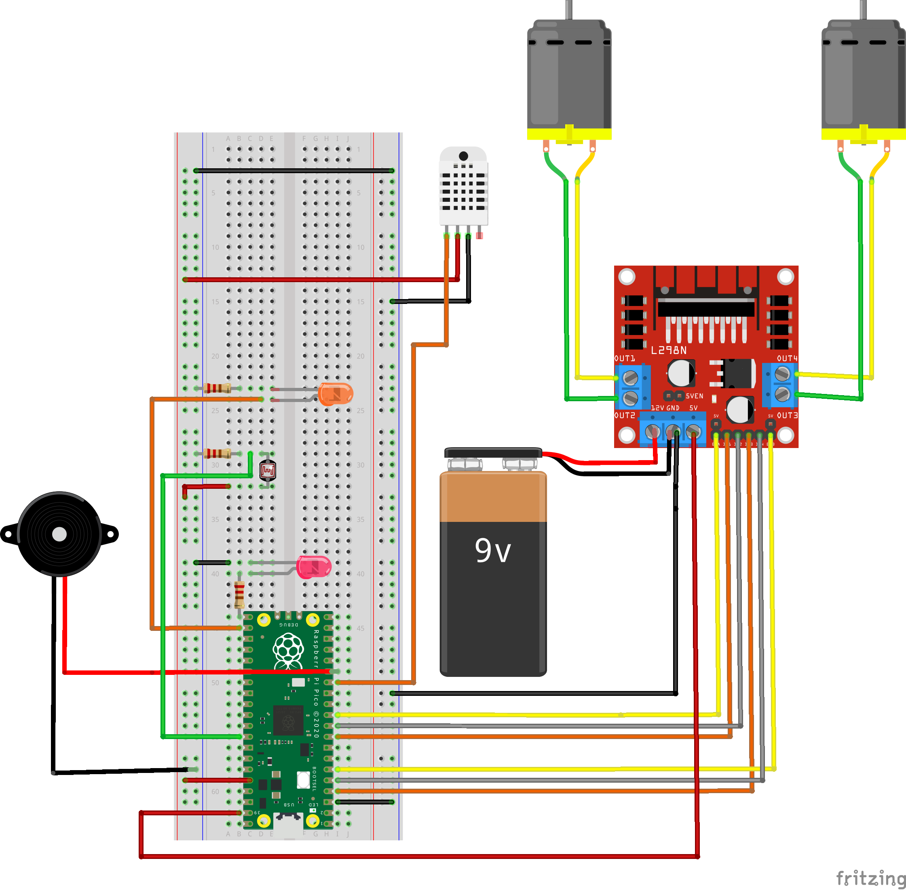
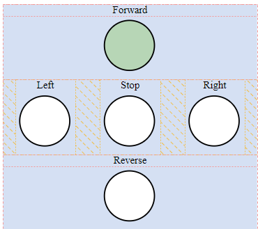

# IoT Wifi controlled car tutorial
__Author__: Emil Karlsson, ek224hy

## Project overview
This is project I developed when taking the [Applied IoT course at Linnéuniversitet](https://lnu.se/en/course/introduction-to-applied-internet-of-things/distance-international-summer/). The project goal is to create a car/robot that can be controlled via a simple webapp when both devices are connected to the same Wifi. The car have 2 motors (its possible to add more motors, you would have to create more motor objects in main.py and have a motor driver card capable of handling more motors) that is controlled via a webserver running [WebSocket protocol](https://en.wikipedia.org/wiki/WebSocket#:~:text=WebSocket%20is%20a%20computer%20communications,as%20RFC%206455%20in%202011) on the Pico board. The server is connected to a client that controls the car. The car can also make use various optional sensors.

__Time effort:__ 4-12 hours, highly depending on your current knowledge. 
__Difficulty:__ Medium for beginners, Easy for experienced

## Objective

My main reason for choosing this project is that it seemed like a fun challenge. I am a web development student at BTH and I have decent understanding of networking, protocols and general coding. So I wanted to create a project that challenged me on both a coding and hardware level. I also hope it will inspire my daughter (or anyone interested) to see that building somewhat advanced projects on your own is achievable and not as difficult as it might initially appear. Additionally, I want to provide project idea that is available for anyone to help them open their minds to the challenge of learning about IoT. 
While the project doesn't necessarily focus heavily on data collection at its current stage. The possibilites of extending its data collecting ability are endless. For example, one could create a racing track and a goalpost, that senses a passing car, and store the the track time in a highscore list or database. This project supports my own personal progress goals (of learning as much as possible both during and after this course) as I easily can expand upon this project as mentioned.
When examinating for this course the car will most likely be equiped with a one or two simple sensors, like a collision sensor or similar with the purpose of being able to visualize some basic data, like collisions and maybe track how many times the car flipped (with a tilt switch or similar).

## Material
I went with the course recommendation to use a Raspberry Pi Pico W(H). It absolutely felt like a good starter MCU as its easy to work with micropython and it offers many IO-pins with neat features, such as a few pins with ADC (analog to digital converter). I did struggle a bit with selecting a correct motor driver card, but the one listed below works perfectly for this project. Most of the other components are stuff I needed to get in order to create my project. There are lots of different car/robot kits than can be used, but the one listed below was available at a decent price. I did purchase a basic soldering iron just for the fun of it and because i want to learn soldering.

| Month    | Component |  Description |Price |
| -------- | ------- | --------| ---- |
|  | [Raspberry Pi Pico W](https://www.electrokit.com/raspberry-pi-pico-w)   | MCU for this project. If you dont want to solder, get the [Pico WH](https://www.electrokit.com/raspberry-pi-pico-wh?gad_source=1&gclid=CjwKCAjw-O6zBhASEiwAOHeGxWUtcyZh5lel_tFE7TW0D3Foy-07vQYDlVK4v4n0q_PkLi4qekNAHBoCxjwQAvD_BwE) and use it with the breadboard listed below. __Make sure you get a USB cable for your Pico__ | 89 SEK |
|  | [Motordriver L298 double H-Bridge 5-35V 2A](https://www.electrokit.com/motordrivare-l298-dubbel-h-brygga-5-35v-2a)| Controls the motor direction and speed. Can operate two different motors at the same time, independent of each other.| 79 SEK |
|  | [Olimex Robot platform](https://www.electrokit.com/olimex-robotplattform-3-hjul) | Main car platform. Was one of the cheapest kits i could find. But another kit can be used as long as the specs allow it. |279 SEK |
|  | [Lab cable 40-pin 30cm male/male](https://www.electrokit.com/labbsladd-20-pin-15cm-hona/hane) |For experimenting and testing. Also perfect if you dont want to solder. You only need a few, like 5-10 |49 SEK |
|  | [Lab cable 40-pin 15cm male/female](https://www.electrokit.com/labbsladd-20-pin-15cm-hona/hane) |For experimenting and testing. Also perfect if you dont want to solder. You only need a few, like 5-10 |29 SEK |
|  | [Breadboard](https://www.electrokit.com/kopplingsdack-840-anslutningar) |For experimenting and testing. Also perfect if you dont want to solder.|69 SEK |
|  | [9V-battery holder](https://www.electrokit.com/batterihallare-9v) |You get a 2-slot AA battery holder with the kit. But i prefered to used the 9V battery, because its not as easy to find high volt AA batteries.|10 SEK |
|  | [9V-battery](https://www.electrokit.com/batteri-9v-6f22) | Enough to power both the MCU (pico) and the motors via the motor driver.|16 SEK |
| __Below__ | __is__ | __optional__ | - |
| | [Soldering kit](https://www.electrokit.com/lodset-starter-kit)| If you want to solder. | 219 SEK |
| | [m2.5 standoff screws](https://www.electrokit.com/distansskruv-m2.5-5mm), [m2.5 screws](https://www.electrokit.com/skruv-ph-m2.5x6) and [m2.5 nut](https://www.electrokit.com/mutter-m2.5)| For fastening your MCU and motordriver (and some sensors). For mcu and driver you will need 8 of each. | 1-5 SEK per piece |

## Setup
### Computer setup
How is the device programmed. Which IDE are you using. Describe all steps from flashing the firmware, installing plugins in your favorite editor. How flashing is done on MicroPython. The aim is that a beginner should be able to understand.
First we should to download and install [Python3](https://www.python.orgdownloads/), and to use Pymakr (explained below), we also need to install [NodeJS](https://nodejs.org/en/).

I decided to use [VScode (download it here: Visual studio code)](https://code.visualstudio.com/) as my IDE (Integrated Devlopment Environment). I have used for for about 3 years and it's often a good choice, in my opinion. Follow the prompts (optional but suggested, add VScode to Path if asked) 
To be able to use VScode with our MCU (Pico), we need to install some extensions. There are a few available extensions for working with Pico and micropython, but let's go with __Pymakr__. After installing VScode go to the extension tab and seach for Pymakr (see picture): 

__Here is a [Pymakr get started guide](https://github.com/sg-wireless/pymakr-vsc/blob/HEAD/GET_STARTED.md) with pictures and steps.__ It provides the installation step mentioned above and instructions on how to set up a project. __I recommend to wait with the starter guide until you have done the Pico setup below.__

Optional, but recommended extension. Since Python3 is indent based, it is very helpful to have the indents colored as it makes it easier for the eye.

__Before__ moving to the Pico-setup we can clone the [iot-rc-car Git repo](https://github.com/emklemkl/iot-rc-car) so it's ready for later.

After downloading, simply unpack the zip-file and open the iot-rc-car project folder with VScode (or any other IDE of your choice)
If opened the project correctly, it should look something like this (ignore the .venv folder, you don't have or need that):

### MCU (Pico) setup
Before we can start writing code and flash it to our MCU, we need to [download](https://micropython.org/download/RPI_PICO_W/) the __lastest__ firmware for micropython. The purpose is to make the Raspberry Pi Pico able to run micropython code. This is done by holding down the BOOTSEL button on the Pico while you connect the USB cable to your PC and Pico simultaneously. 

This causes the Pico to appear as a mass storage device (like any USB-storage device or other external hard drive) and can often be found under "This PC" on Windows. Simply drag and drop the downloaded firmware file (its probably a .uf2 file). Now the Pico is ready to handle python code. Simply unplugg and plugg your device again. Now is a good time to follow the previosly mentioned [Pymakr get started guide](https://github.com/sg-wireless/pymakr-vsc/blob/HEAD/GET_STARTED.md). As you can see in the guide there is an easy to use dev-mode coming with the extension, it takes care of uploading and restarting your micropython code whenever you make changes to the code. The dev-mode works fine, most of the time, but i can sometimes be a bit finicky and you have to help the program by pressing the "Sync project to device"-button below (see Pymakr guide).

How is all the electronics connected? Describe all the wiring, good if you can show a circuit diagram. Be specific on how to connect everything, and what to think of in terms of resistors, current and voltage. Is this only for a development setup or could it be used in production?
Circuit diagram (can be hand drawn)
*Electrical calculations
Platform
Describe your choice of platform. If you have tried different platforms it can be good to provide a comparison.
### Wiring and components
In short, the 9V battery powers the L298N motor driver card. The driver card is equiped with a 5V volt regulator (marked as 5VEN on the image below) and as long as the jumper plug (small connector that connects the 2 pins) is connected, the L298N outputs 5V (To the right of the 12v and GND) which we can use to power our Pico board via the VSYS pin(39), which works fine because the VSYS expects between 1.8 to 5.5V. The RED  wires are generally representing the power source connections. It's important to note that the  BLACK wires is all connected to a common ground (the squared pins on the pico are all GND/Ground). The YELLOW wires connected between the Pico (green board) and the L298N (red board) are both connected to pins named ENA (left one is for left motor) and ENB (for right motor) and these pin controll the speed of their respective motor, if these pins are not used, the motors will always go at full speed These pins are controlled with PWM (converts a digital signal into an analog signal by varying the duty cycle of a square wave pulse).
The ORANGE and GREY wires are connected to pins named IN1/IN2 (left motor) and IN3/IN4 (right motor). These pins simply control the direction of the motors by getting input from the Pico.

The YELLOW and GREEN wires between the 6V DC motors are the power supply to the motor. These are controlled via the previously name INx/INy pins. Depending on which wires gets powered the motors spin in different directions.

The CYAN wire is for a humidity sensor that is added temporarily because I needed some data to display. My goal is to replace this with a sensor for measuring the speed of the car (using the encoder discs that come with the wheels).

Is your platform based on a local installation or a cloud? Do you plan to use a paid subscription or a free? Describe the different alternatives on going forward if you want to scale your idea.

## Connectivity setup
__Remember to use / or \ for paths, depending on your OS.__
### Connect to Wifi 
1. Create server\src\keys.py
1. Add the variables: 
    * WIFI_SSID = < REPLACE EVERYTHING AFTER '=' WITH YOUR "WIFI NAME" >
    * WIFI_PASS = < SAME HERE BUT ENTER YOUR "WIFI PASSWORD">
    * __Your ssid and password must be enclosed with " " ("my-password")__

### Setup client connection
##### Get your Pico servers address: 
Your Pico's assigned IP will be shown when you flash code to the device and the device restarts:

__Note that my IP is in the format of "XXX.XXX.X.XX" (your might differ a bit) followed by ":" to indicate port number, which is "3000"__
1. Open client/functions.js and set the variables:
    * CONNECT_TO_IP = <"Your Pico server IP">
    * CONNECT_TO_PORT = <"Prefered port (the preset one used is 3000)">

Describe platform in terms of functionality
*Explain and elaborate what made you choose this platform

## Data visulization
I decided to use Adafruit for it's simplicity. I wanted to useNode-red but I have very limited time at the moment so I went with Adafruit. My project haven't been so heavily focused on data collection, I did install a temperature sensor to actually have some real data to send to Adafruit. My goal, if I have time, is to install a sensor for measuring the speed of the car. If I can't, I will simply add some more general sensor to have some data to display.

The code
Import core functions of your code here, and don't forget to explain what you have done! Do not put too much code here, focus on the core functionalities. Have you done a specific function that does a calculation, or are you using clever function for sending data on two networks? Or, are you checking if the value is reasonable etc. Explain what you have done, including the setup of the network, wireless, libraries and all that is needed to understand.

## Code
The main stars in my project is probably the motors. I decided to create a Motor class to easily control each individual motor. This makes it a  walk in the park to create the main controls for the the Client that is controlling the car.

## Server/Backend
The car is running it's own server with WebSocket protocol. As soon as it detects signals from the client it is ready to let the client control the car.

### motor.py
    class Motor():
        MAX_DUTY_CYCLE = 65535
        def __init__(self, pin_x : Pin, pin_y : Pin, pin_pwm : Pin) -> None:
            self.IN_X = pin_x
            self.IN_Y = pin_y
            self.pwm = PWM(pin_pwm, freq = 500)
            self.set_speed()
        def forward(self) -> None:
            self.IN_X.value(1) 
            self.IN_Y.value(0)  

        def reverse(self) -> None:
            self.IN_X.value(0)
            self.IN_Y.value(1) 

        def stop(self) -> None:
            self.IN_X.value(0) 
            self.IN_Y.value(0) 
        def ....

### main.py
The main file contains a bit more code than necessary at the moment, but its main feature is the while loop that keeps the WebSocket server alive. Each loop checks if new instructions have been sent from the client, if a new instruction is detected the car will act upon it instantly.

    try:
        server = AppServer()
        server.start(3000)
        temp_hum = TemperatureHumidity(Pin(10))
        while True:
            temp = temp_hum.measure_temp()
            client.check_msg()# Action a message if one is received. Non-blocking.
            if temp:
                send_temp(temp)     # Send a random number to Adafruit IO if it's time.
            server.process_all()
            time.sleep(0.3)
    except KeyboardInterrupt:
        pass

## Client/Frontend

The client runs a WebSocket protocol to have full duplex communication between the server and client. The client consists of functions.js and index.html which in combination is used to control the car. At the moment the controls for the car have a very basic setup.

### functions.js
This JavaScript code simply connects to the server that is running on the Pico (on the car) as soon as any device visits the clients ip.

    const CONNECT_TO_IP = "XXX.XXX.X.XX"
    const CONNECT_TO_PORT = "3000"
    let ws;
    let interval = null;
    window.addEventListener("load", establishWebSocketConnection)

    carControllerDiv = document.getElementById("car-controller");
    carControllerDiv.addEventListener("change", (e) => {
        drive(e.target.value)
    })

    async function establishWebSocketConnection() {
        ws = new WebSocket(`ws://${CONNECT_TO_IP}:${CONNECT_TO_PORT}`);
        ws.onerror = function (event) {
            console.error("WebSocket error observed:", event);
        };

        ws.onopen = function (event) {
            console.log("WebSocket is open.");
            ws.send('Client connected');
        };
    }

    function drive(value) {
        ws.send(value)
    }

# Explain your code! 

# To be continued...

Transmitting the data / connectivity
How is the data transmitted to the internet or local server? Describe the package format. All the different steps that are needed in getting the data to your end-point. Explain both the code and choice of wireless protocols.

How often is the data sent?
Which wireless protocols did you use (WiFi, LoRa, etc …)?
Which transport protocols were used (MQTT, webhook, etc …)
*Elaborate on the design choices regarding data transmission and wireless protocols. That is how your choices affect the device range and battery consumption.
Presenting the data
Describe the presentation part. How is the dashboard built? How long is the data preserved in the database?

Provide visual examples on how the dashboard looks. Pictures needed.
How often is data saved in the database.
*Explain your choice of database.
*Automation/triggers of the data.
Finalizing the design
Show the final results of your project. Give your final thoughts on how you think the project went. What could have been done in an other way, or even better? Pictures are nice!

Show final results of the project
Pictures
*Video presentation
