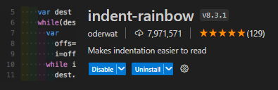
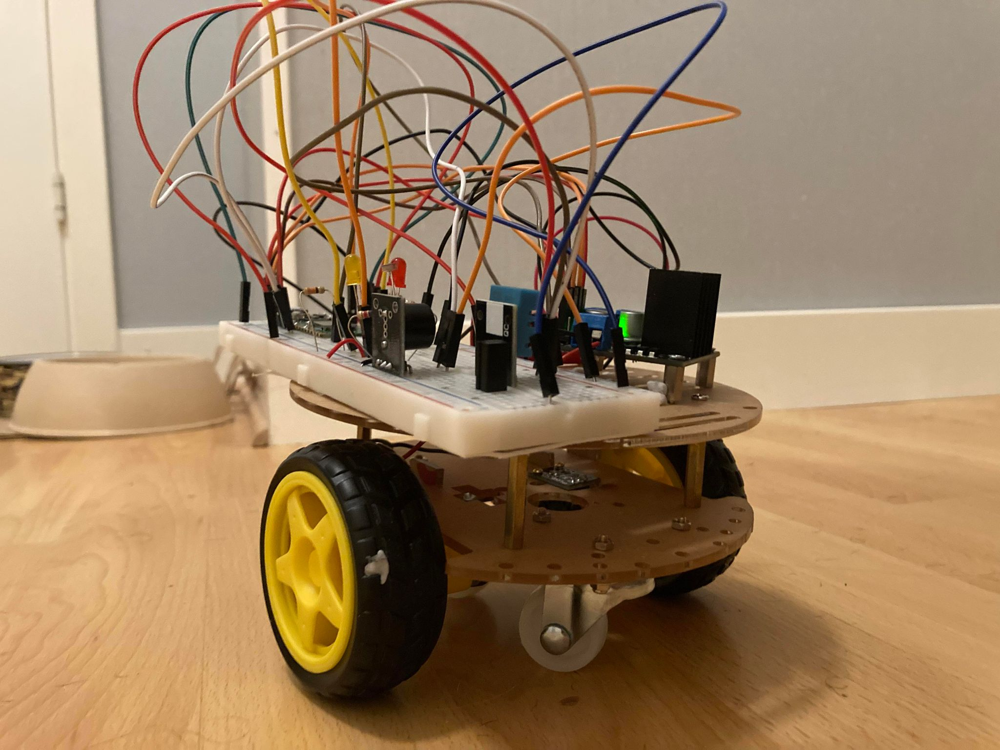

# IoT Wifi controlled car tutorial
__Author__: Emil Karlsson, ek224hy

## Project overview
This is project I developed when taking the [Applied IoT course at Linnéuniversitet](https://lnu.se/en/course/introduction-to-applied-internet-of-things/distance-international-summer/). The project goal is to create a car/robot that can be controlled via a simple webapp when both devices are connected to the same Wifi. The car have 2 motors (its possible to add more motors, you would have to create more motor objects in main.py and have a motor driver card capable of handling more motors) that is controlled via a webserver running [WebSocket protocol](https://en.wikipedia.org/wiki/WebSocket#:~:text=WebSocket%20is%20a%20computer%20communications,as%20RFC%206455%20in%202011) on the Pico board. The server is connected to a client that controls the car. The car can also make use various optional sensors.

__Time effort:__ 4-12 hours, highly depending on your current knowledge. 
__Difficulty:__ Medium for beginners, Easy for experienced

## Objective

My main reason for choosing this project is that it seemed like a fun challenge. I am a web development student at BTH and I have decent understanding of networking, protocols and general coding. So I wanted to create a project that challenged me on both a coding and hardware level. I also hope it will inspire my daughter (or anyone interested) to see that building somewhat advanced projects on your own is achievable and not as difficult as it might initially appear. Additionally, I want to provide project idea that is available for anyone to help them open their minds to the challenge of learning about IoT. 
While the project doesn't necessarily focus heavily on data collection at its current stage. The possibilites of extending its data collecting ability are endless. For example, one could create a racing track and a goalpost, that senses a passing car, and store the the track time in a highscore list or database. This project supports my own personal progress goals (of learning as much as possible both during and after this course) as I easily can expand upon this project as mentioned.
When examinating for this course the car will most likely be equiped with a one or two simple sensors, like a collision sensor or similar with the purpose of being able to visualize some basic data, like collisions and maybe track how many times the car flipped (with a tilt switch or similar).

## Material
I went with the course recommendation to use a Raspberry Pi Pico W(H). It absolutely felt like a good starter MCU as its easy to work with micropython and it offers many IO-pins with neat features, such as a few pins with ADC (analog to digital converter). I did struggle a bit with selecting a correct motor driver card, but the one listed below works perfectly for this project. Most of the other components are stuff I needed to get in order to create my project. There are lots of different car/robot kits than can be used, but the one listed below was available at a decent price. I did purchase a basic soldering iron just for the fun of it and because i want to learn soldering.

| Picture    | Component |  Description |Price |
| -------- | ------- | --------| ---- |
|  | [Raspberry Pi Pico W](https://www.electrokit.com/raspberry-pi-pico-w)   | MCU for this project. If you dont want to solder, get the [Pico WH](https://www.electrokit.com/raspberry-pi-pico-wh?gad_source=1&gclid=CjwKCAjw-O6zBhASEiwAOHeGxWUtcyZh5lel_tFE7TW0D3Foy-07vQYDlVK4v4n0q_PkLi4qekNAHBoCxjwQAvD_BwE) and use it with the breadboard listed below. __Make sure you get a USB cable for your Pico__ | 89 SEK |
|  | [Motordriver L298 double H-Bridge 5-35V 2A](https://www.electrokit.com/motordrivare-l298-dubbel-h-brygga-5-35v-2a)| Controls the motor direction and speed. Can operate two different motors at the same time, independent of each other.| 79 SEK |
|  | [Olimex Robot platform](https://www.electrokit.com/olimex-robotplattform-3-hjul) | Main car platform. Was one of the cheapest kits i could find. But another kit can be used as long as the specs allow it. |279 SEK |
|  | [Lab cable 40-pin 30cm male/male](https://www.electrokit.com/labbsladd-20-pin-15cm-hona/hane) |For experimenting and testing. Also perfect if you dont want to solder. You only need a few, like 5-10 |49 SEK |
|  | [Lab cable 40-pin 15cm male/female](https://www.electrokit.com/labbsladd-20-pin-15cm-hona/hane) |For experimenting and testing. Also perfect if you dont want to solder. You only need a few, like 5-10 |29 SEK |
|  | [Breadboard](https://www.electrokit.com/kopplingsdack-840-anslutningar) |For experimenting and testing. Also perfect if you dont want to solder.|69 SEK |
|  | [9V-battery holder](https://www.electrokit.com/batterihallare-9v) |You get a 2-slot AA battery holder with the kit. But i prefered to used the 9V battery, because its not as easy to find high volt AA batteries.|10 SEK |
|  | [9V-battery](https://www.electrokit.com/batteri-9v-6f22) | Enough to power both the MCU (pico) and the motors via the motor driver.|16 SEK |
|  | [Led](https://www.electrokit.com/led-5mm-rod-diffus-1500mcd) | Need 2 or more|5 SEK |
|  | [Photo resistor](https://www.electrokit.com/fotomotstand-cds-4-7-kohm) | Need 1 or more|8 SEK |
|  | [10kohm resistor](https://www.electrokit.com/motstand-kolfilm-0.25w-10kohm-10k) | Need 1 or more|1 SEK |
|  | [330ohm resistor](https://www.electrokit.com/motstand-kolfilm-0.25w-330ohm-330r) | Need 2 or more|1 SEK |
|  | [DHT11 sensor](https://www.electrokit.com/digital-temperatur-och-fuktsensor-dht11) | Need 1 for measuring temperature and moisture |49 SEK |
|  | [Active piezo speaker](https://www.electrokit.com/piezohogtalare-aktiv) | Need 1 for creating the car horn |39 SEK |
| __Below__ | __is__ | __optional__ | - |
| | [Soldering kit](https://www.electrokit.com/lodset-starter-kit)| If you want to solder. (Get something better than this one though)| 219 SEK |
| | [Wire](https://www.electrokit.com/kopplingstrad-0.28mm2-entradig-rod-/m)| If you want to solder. | 15 SEK |
| | [m2.5 standoff screws](https://www.electrokit.com/distansskruv-m2.5-5mm), [m2.5 screws](https://www.electrokit.com/skruv-ph-m2.5x6) and [m2.5 nut](https://www.electrokit.com/mutter-m2.5)| For fastening your MCU and motordriver (and some sensors). For mcu and driver you will need 8 of each. | 1-5 SEK per piece |

## Setup
### Computer setup

First we should to download and install [Python3](https://www.python.orgdownloads/), and to use Pymakr (explained below), we also need to install [NodeJS](https://nodejs.org/en/).

I decided to use [VScode (Visual studio code)](https://code.visualstudio.com/) as my IDE (Integrated Devlopment Environment). I have used for for about 3 years and it's often a good choice, in my opinion. Follow the prompts (optional but suggested, add VScode to Path if asked) 
To be able to use VScode with our MCU (Pico), we need to install some extensions. There are a few available extensions for working with Pico and micropython, but let's go with __Pymakr__. After installing VScode go to the extension tab and seach for Pymakr (see picture): 

__Here is a [Pymakr get started guide](https://github.com/sg-wireless/pymakr-vsc/blob/HEAD/GET_STARTED.md) with pictures and steps.__ It provides the installation step mentioned above and instructions on how to set up a project. __I recommend to wait with the starter guide until you have done the Pico setup below.__

Optional, but recommended extension. Since Python3 is indent based, it is very helpful to have the indents colored as it makes it easier for the eye.

__Before__ moving to the Pico-setup we can clone the [iot-rc-car Git repo](https://github.com/emklemkl/iot-rc-car) so it's ready for later.

After downloading, simply unpack the zip-file and open the iot-rc-car project folder with VScode (or any other IDE of your choice)
If opened the project correctly, it should look something like this (ignore the .venv folder, you don't have or need that):

### MCU (Pico) setup
Before we can start writing code and flash it to our MCU, we need to [download](https://micropython.org/download/RPI_PICO_W/) the __lastest__ firmware for micropython. The purpose is to make the Raspberry Pi Pico able to run micropython code. This is done by holding down the BOOTSEL button on the Pico while you connect the USB cable to your PC and Pico simultaneously. 

This causes the Pico to appear as a mass storage device (like any USB-storage device or other external hard drive) and can often be found under "This PC" on Windows. Simply drag and drop the downloaded firmware file (its probably a .uf2 file). Now the Pico is ready to handle python code. Simply unplugg and plugg your device again. Now is a good time to follow the previosly mentioned [Pymakr get started guide](https://github.com/sg-wireless/pymakr-vsc/blob/HEAD/GET_STARTED.md). As you can see in the guide there is an easy to use dev-mode coming with the extension, it takes care of uploading and restarting your micropython code whenever you make changes to the code. The dev-mode works fine, most of the time, but i can sometimes be a bit finicky and you have to help the program by pressing the "Sync project to device"-button below (see Pymakr guide).

### Putting it together
In short, the 9V battery powers the L298N motor driver card. The driver card is equiped with a 5V volt regulator (marked as 5VEN on the image below) and as long as the jumper plug (small connector that connects the 2 pins) is connected, the L298N outputs 5V (To the right of the 12v and GND) which we can use to power our Pico board via the VSYS pin(39), which works fine because the VSYS expects between 1.8 to 5.5V. The RED  wires are generally representing the power source connections. It's important to note that the  BLACK wires is all connected to a common ground (the squared pins on the pico are all GND/Ground). The YELLOW wires connected between the Pico (green board) and the L298N (red board) are both connected to pins named ENA (left one is for left motor) and ENB (for right motor) and these pin controll the speed of their respective motor, if these pins are not used, the motors will always go at full speed These pins are controlled with PWM (converts a digital signal into an analog signal by varying the duty cycle of a square wave pulse).
The ORANGE and GREY wires are connected to pins named IN1/IN2 (left motor) and IN3/IN4 (right motor). These pins simply control the direction of the motors by getting input from the Pico.

The YELLOW and GREEN wires between the 6V DC motors are the power supply to the motor. These are controlled via the previously name INx/INy pins. Depending on which wires gets powered the motors spin in different directions.

The CYAN wire is for a temperature and humidity sensor added to track the temperature of the car chassis. My goal was to build this project inside a junction box and to use the temperature sensor to notify the driver if the box gets hot.

The led lights on the diagram is optional and doesn't really affect the vehicle. The Orange one turns on if it's dark, you can see it as a cars headlights. The red one is like a glowing when you reverse the car.
The black circle to the right is piezo-speaker (buzzer) it's supposed to represent the cars horn. These utilities

## Electrical Safety Tips
There are some few key notes we need to be aware of as to not damage our hardware. First, follow the diagram, the leds need a 330ohm resistor, else they might get hot and fail. The most important note, is to pay attention to where you connect the battery. If you provide the L298N (red card) with a 9V battery AND have the jumper (small black connector) connecting the two pins (marked with 5VEN) for the 5V regulator in place. The L298N will output 5V that you can use to supply power your Pico via VSYS, which (see diagram). Be very mindfull not to accidently provide your Pico with directly from the 9V battery, I made that misstake and it fried my Pico. The Pico have its own 3.3v regulator that allows the Pico to supply 3.3v to the rest of the board and its GPIO. However it needs to be provided with __1.8V to 5.5V__ for it to work.
The motors are capable of handling up to 6V each so we will not be able 2 use their full potential with a 9V battery, but it is good enough. If you have a batterypack of 12V you can use that instead. Just be sure to not go over the 12V specified on the L298N for this project. 
The design of the L298N cause some voltage drop that we can't do anything about. 

## Connectivity setup
__Remember to use / or \ for paths, depending on your OS.__
#### Connect to Wifi 
1. Create server\src\keys.py
1. Add the variables: 
    * WIFI_SSID = < REPLACE EVERYTHING AFTER '=' WITH YOUR "WIFI NAME" >
    * WIFI_PASS = < SAME HERE BUT ENTER YOUR "WIFI PASSWORD">
    * __Your ssid and password must be enclosed with " " ("my-password")__

### Setup client connection
##### Get your Pico servers address: 
Your Pico's assigned IP will be shown when you flash code to the device and the device restarts:

__Note that my IP is in the format of "XXX.XXX.X.XX" (your might differ a bit) followed by ":" to indicate port number, which is "3000"__
1. Open client/functions.js and set the variables:
    * CONNECT_TO_IP = <"Your Pico server IP">
    * CONNECT_TO_PORT = <"Prefered port (the preset one used is 3000)">

### Platform for visualizing data

I decided to use Adafruit for it's simplicity. I initially considered using Node-RED, but due to current time constraints and the need to prioritize setting up the car's functionality, I opted for Adafruit to better manage my time (an area I am actively working to improve). My project haven't been so heavily focused on data collection which contributed to the decision to go for a simpler service for thihs purpose, I did install a temperature sensor to monitor the enclosure/chassi where the pico and the other components are mounted to make sure it doesnt get to heated. 
I also installed an optical encoder that could read encoder discs on the wheels in order to calculate the speed of the vehicle (see image below), wtih the purpose of sending the speed data to my Adafruit dashboard. I got it working and had the math figured out. However the sensor and the discs werent really as compatible as I had hoped. So their ability to give reliable speed data wasn't good, thus i decided to scrap that feature, the downside is that I dont have as much data to show on my dashboard.

Another good aspect of Adafruit is that their API is super easy to use and with a simple fetch I can display the same data ive uploaded on my own webapp/client.

If you want to display your readings on Adafruit you to need to create an Adafruit account and set up the feeds. Next step if you want your readings mean value to be displayed in the webapp (controller) you need to paste your Adafruit key in functions.js

Like:

    async function fetchData() {
    const url = `https://io.adafruit.com/api/v2/emklemkl/feeds/temperature/data?limit=10`;
    const response = await fetch(url, {
        headers: {
            'X-AIO-Key': "xxx_xxxxxxxxxxxxxx"
        }
    });

## Code
The main stars in my project is probably the motors. I decided to create a Motor class to easily control each individual motor. This makes it a  walk in the park to create the main controls for the the Client that is controlling the car. 

## Server/Backend
The car is running it's own server with WebSocket protocol. As soon as it detects signals from the client it is ready to let the client control the car via the web app controller (phone/pc). It was a bit more challenging than expected to the get the connection between the client and backend without disturbances. I ended up writing some async code in order to not block any instructions coming from the client.

### motor.py
This class hold all the functions needed to control the speed or direction of the motors. 

    class Motor():
        MAX_DUTY_CYCLE = 65535
        def __init__(self, pin_x : Pin, pin_y : Pin, pin_pwm : Pin) -> None:
            self.IN_X = pin_x
            self.IN_Y = pin_y
            self.pwm = PWM(pin_pwm, freq = 500)
            self.set_speed()
        def forward(self) -> None:
            self.IN_X.value(1) 
            self.IN_Y.value(0)  

        def reverse(self) -> None:
            self.IN_X.value(0)
            self.IN_Y.value(1) 

        def stop(self) -> None:
            self.IN_X.value(0) 
            self.IN_Y.value(0) 
        def ....

### main.py
The main file contains a while loop. Each loop checks if new instructions have been sent from the client(phone/pc) to the server(Pico/MCU), if a new instruction is detected the car will act upon it next iteration. Because of the sleep-functions you can send up to 10 commands every second, and use of asynchronous programming allows you to provide other instructions without blocking the driving functionality. For example, you can spam the "honk" button without losing the ability to steer the car.

The main loop is a function that is called from a try except block after the server object have been initialized.

    async def main_loop():
        ts = time.time()
        while True:
            if ts + NIGHT_LIGHT_CHECK_TIME < time.time():
                night_light.led_control()
                ts = time.time()
            temp = temp_hum.measure_temp()
            client.check_msg()
            if temp:
                send_temp(temp)  # Send a current temp to Adafruit IO if it's time.
            server.process_all()
            await asyncio.sleep(0.1)

    try:
        server = AppServer()
        server.start(3000)
        temp_hum = SensorDHT11(Pin(10))
        night_light = NightLight(ADC(27), Pin(17, Pin.OUT), 59000)
        asyncio.run(main_loop())
    except KeyboardInterrupt:
        pass
    server.stop()

## Client/Frontend

The client runs a WebSocket protocol to have full duplex communication between the server and client. The client consists of functions.js and index.html which in combination is used to control the car. I decided to create a radio button inspired controller, the main reason is that it was faster than creating a virtual joystick, the second reason is that it is more fun to drive it like this as it is more challenging. The controller also have a horn that you can sound with the "honk" button (on the cat its just a simple piezo buzzer that i found in the sensor pack). You can increase and decrease the speed of the car with the slider without blocking any functionality. Below you can see the car temperature values. My plan is you solder together all parts and put them inside a simple chassi (like a small junction box), and when all the parts are enclosed I want instand feedback of the temperature inside the chassi. The temperature data is fetched from the Adafruit API and then i display the mean value of the last X datapoints sent to my Adafruit feed.

__To start the client__ open a terminal (Win + R, write "cmd" then press enter) navigate to the folder \client using "cd some\folder\iot-project\client. Then run the command: python3 -m http.server 9000. You can now find the client/webapp in your browser by entering localhost:9000 in the search bar. When you enter the app the connection to the Pico/server should happen automagically (make sure the pico is powered).

### functions.js
This JavaScript code simply connects to the server that is running on the Pico (on the car) as soon as any device visits the clients ip.

    const CONNECT_TO_IP = "XXX.XXX.X.XX"
    const CONNECT_TO_PORT = "3000"
    let ws;
    let interval = null;
    window.addEventListener("load", establishWebSocketConnection)

    carControllerDiv = document.getElementById("car-controller");
    carControllerDiv.addEventListener("change", (e) => {
        drive(e.target.value)
    })

    async function establishWebSocketConnection() {
        ws = new WebSocket(`ws://${CONNECT_TO_IP}:${CONNECT_TO_PORT}`);
        ws.onerror = function (event) {
            console.error("WebSocket error observed:", event);
        };

        ws.onopen = function (event) {
            console.log("WebSocket is open.");
            ws.send('Client connected');
        };
    }

    function drive(value) {
        ws.send(value)
    }

### index.html

    <body>
    

        

            

                <label for="forward-left">Forw/Left</label>
                <input type="radio" id="forward-left" class="radio" name="radio-sel" value="fL">
            

            

                <label for="forward">Forward</label>
                <input type="radio" id="forward" class="radio"  name="radio-sel" value="f">
            

        ....
## Transmitting data

#### Wifi
As mentioned earlier the program is Wifi driven. The Pico board mounted on the car runs a server that receives instructions from the client using WebSocket protocol. Using Wifi in this case has it's pros and cons. For the steering of the car my life would probably have been easier if I used IR sensors or Bluetooth as to not having to deal with ip-addresses back and forth, but i learned a lot so it feels like a good choice for that purpose. I also noticed I have some "Wifi dead zones" in my house when I was testing out the car, which negatively impacts the experience. 

#### Transport protocols
The temperature data is sent to Adafruit once every few seconds using the MQTT protocol. I had not used MQTT before, so it was interesting to try it out. Even though I only did the basics, it was a good learning experience beyond the more common HTTP(S) protocol. 
Because my device is battery powered (9V) the use of MQTT also felt like a good idea due to MQTT's ability to keep the overhead low. MQTT sends less non-essential data than for example HTTP whose headers are somewhat verbose, which contributes to decreasing battery consumption.
I most likely could have used the WebSocket protocols full duplex ability to communicate my data. But one the reasons i didn't is, as i meantioned, that I wanted to try out MQTT. Since I mainly use the WebSocket protocol to communicate from the client to the server/car, one could argue that it would have been cheaper to use Server Sent events as the overhead is smaller. But that would have required a more complex client, I simply wanted the oportunity to try out WebSockets with my IoT project.

## Presenting the data
The dashboard is really simple and doesnt really differ from the guide. I implemented a webhook (for a discord server that I always have active) to send a message if the temperature inside the chassi gets to high. Ideally I should make use of the websocket connection and instantly send a warning message to the webapp that controls the device. But this is more of an extra goal if I should find the time.

I didn't manage to find an answer to how long the data is stored on Adafruit. But as my data isn't really analyze worthy during this stage I don't see it as a problem. The temperature data in its current stage is intended for fire hazard prevention, hence why I wanted to implement a warning in the app if the car gets hot.

## End result

The project was challenging, there were many small details that required a lot of my attention in order for the car to actually be usable. I had some ups and downs, but the only real regret I have is the lack of time, as I'm working full-time alongside this course. I didn't have time to implement all of my ideas on this project. Some things had to be scrapped, such as the previously mention speed calculator, due to incompatible hardware. However, i feel that i got to try out all the elements I wanted. I wanted to create a code focused projects where I had to explore unknown territory, such as WebSockets with micropython, I even had to do some soldering due to the fact that i fried my first Pico WH and only had a Pico W (without headers) left. So I had to move the pins. I wish i had spent some more time dealing with different ways to visualize data. Adafruit was nice, but very simple and it took only 20 minutes to get it running. But because I started to work on the data visualization pretty late I simply had to select one and stick with it. I did try out Node-red, but as I am working on Windows I had some undesirable service issues that I didn't want to deal with at the time. 

Other things I could have done better is to make more commits when I'm coding. I often end up with massive commits and pull requests. Also I spent a lot of time thinking about what project to do and how to do it, instead of just starting with something spontaneus and see were i end up. I believe I would have benefited from spending more time just building simple LED circuits or similar small projects the first week or two.

(There is a demo video at the bottom of the page)

In the end, I have had much fun and learned a lot! :)

